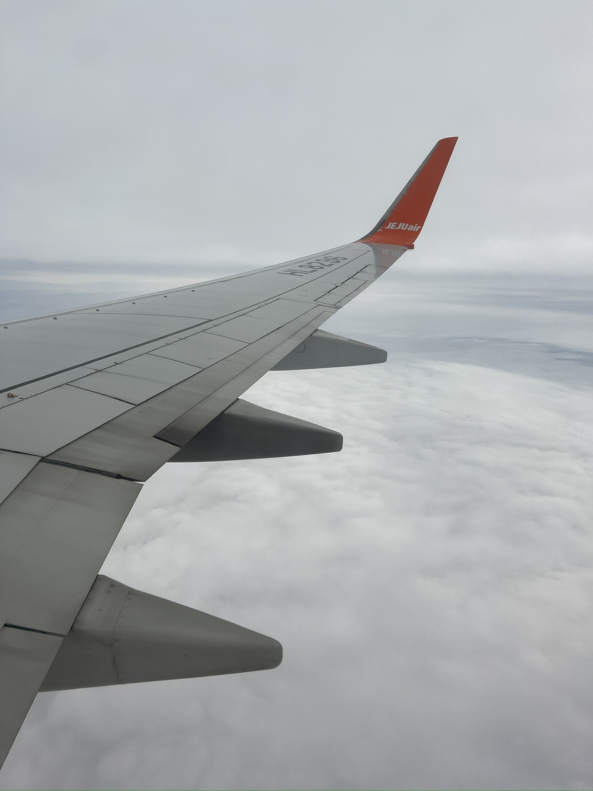

# 2024.02.01

오늘은 제주도 여행의 끝이다. 5박 6일이 너무 후딱 지나간거 같다. 너무 많이 힐링도 되었고 이를 바탕으로 다시 본업으로 돌아가야겠다. 내일부터는 다시 시작이다. 20일 가량 남은 정보처리기사 자격증 공부를 다시 시작해보고 깃 공부 커밋도 시작할 예정이다. 세미나 준비 및 취업준비 또는 대학원 생각을 하면서 이번 4학년을 시작해볼까 한다. 한달 남은 방학 좀 알차게 보내야겠다.

<figure><figcaption></figcaption></figure>
